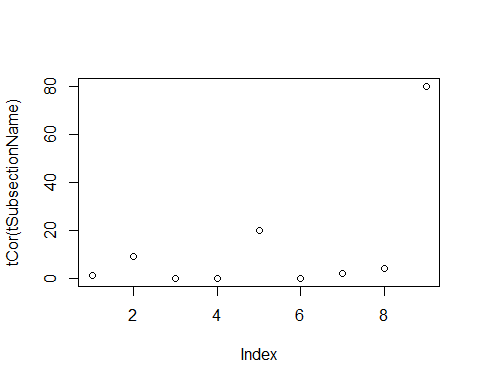
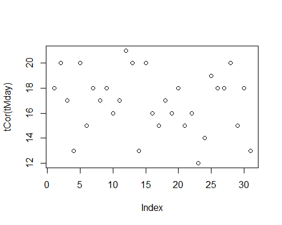
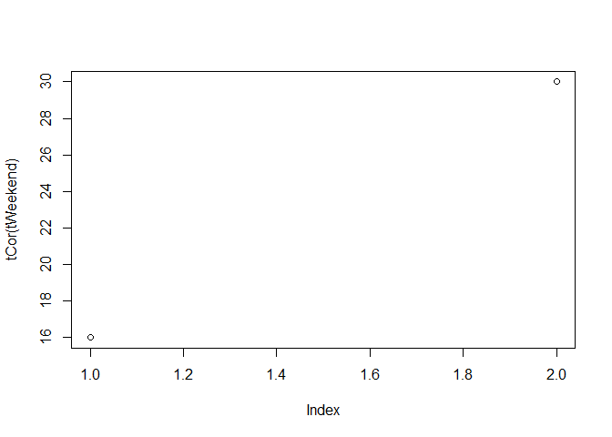
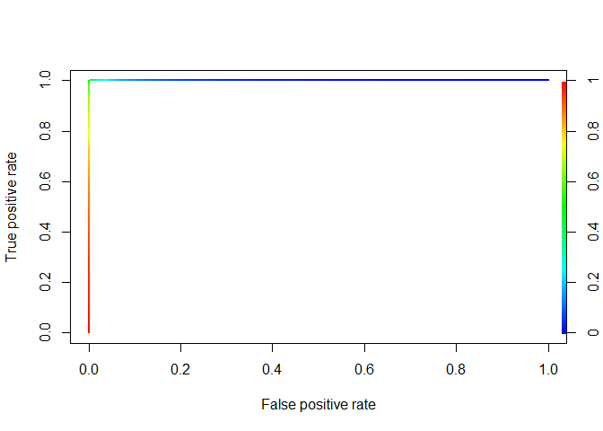
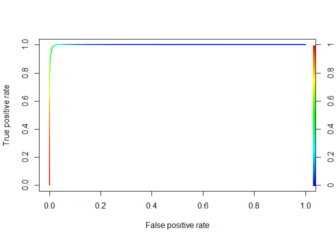

# Analytic Edge Kaggle NYT classifiction
Ryan Zhang  
Thursday, April 16, 2015  

# 0 Environment
# 环境设定
## Set working directory
## 设定工作环境

```r
setwd("~/GitHub/edX/The Analytic Edge/Kaggle")
```

## Load Libraries
## 函数包

```r
library(RTextTools)
```

```
## Loading required package: SparseM
## 
## Attaching package: 'SparseM'
## 
## The following object is masked from 'package:base':
## 
##     backsolve
```

```r
library(plyr)
library(Matrix)
library(tm)
```

```
## Loading required package: NLP
```

```r
library(e1071)
library(caTools)
library(randomForest)
```

```
## randomForest 4.6-10
## Type rfNews() to see new features/changes/bug fixes.
```

```r
library(ROCR)
```

```
## Loading required package: gplots
## 
## Attaching package: 'gplots'
## 
## The following object is masked from 'package:stats':
## 
##     lowess
```

## Function Definition
## 自定义函数

```r
tCor <- function(t)round(t[,2]/rowSums(t),2)*100 
```

# 1 Data Preparing
# 1 数据准备工作
## 1.1 Data Loading
## 1.1 装载数据

```r
NewsTrain <- read.csv("NYTimesBlogTrain.csv", stringsAsFactors = F)
NewsTest <- read.csv("NYTimesBlogTest.csv", stringsAsFactors = F)
```

## 1.2 First Iteration in processing
## 1.2 第一轮数据处理
"Popular"" is the dependant variable, store it in a separate vector "Y", and delete the colomn from the 
dataframe "NewsTrain". 
要预测的因变量是“Popular”，将其存在一个单独的"Y"向量中,并从训练数据框中删除该列。

```r
Y <- as.factor(NewsTrain$Popular)
NewsTrain$Popular <- NULL
```

Store the number of training data points and the number of testing data points.
记录一下训练数据和测试数据的数量。

```r
ntrain <- nrow(NewsTrain)
ntest <- nrow(NewsTest)
ntrain
```

```
## [1] 6532
```

```r
ntest
```

```
## [1] 1870
```

Combine "NewsTrain" and "NewsTest" into a single dataframe for the purpose of data preparing
将训练数据和测试数据合并为一个单一的数据框，以便集中处理（这是否有问题？）

```r
OriginalDF <- rbind(NewsTrain, NewsTest)
```

Filling empty entries for the first three columns with name "Other"
将前三列里面的“”用“Other”替代

```r
for (i in 1:nrow(OriginalDF)){
  for (j in 1:3){
    if (OriginalDF[i,j] == ""){
      OriginalDF[i,j] <- "Other"
    }
  }
}
```

Change the first three columns to be factors
将前三个变量改成factor类型

```r
OriginalDF$NewsDesk <- as.factor(OriginalDF$NewsDesk)
OriginalDF$SectionName <- as.factor(OriginalDF$SectionName)
OriginalDF$SubsectionName <- as.factor(OriginalDF$SubsectionName)
```

Transfer "WordCount" into Z-score
将WordCount转换为标准值

```r
OriginalDF$ZWordCount <- with(OriginalDF, (WordCount - mean(WordCount))/sd(WordCount))
OriginalDF$NWordCount <- log(OriginalDF$WordCount + 1)
```

Conver the PubDate and time variable to be more R friendly and extract the hour of day, the day on month and the day of week to be seperate variables. Finally delete the PubDate column.
将PubDate改成R的日期-时间格式，并将周几、每月几号以及每天几点这些信息单独抽取出来，删除原本的PubDate

```r
OriginalDF$PubDate <- strptime(OriginalDF$PubDate, "%Y-%m-%d %H:%M:%S")
OriginalDF$Hour <- as.factor(OriginalDF$PubDate$h)
OriginalDF$Wday <- as.factor(OriginalDF$PubDate$wday)
OriginalDF$Mday <- as.factor(OriginalDF$PubDate$mday)
OriginalDF$isWeekend <- as.numeric(OriginalDF$Wday %in% c(0,6))
OriginalDF$PubDate <- NULL
```

Generate training and testing set
生成训练和测试数据

```r
train <- OriginalDF[1:ntrain, c(1:3,7,9:14)]
test <- OriginalDF[(ntrain+1):nrow(OriginalDF),c(1:3,7,9:14)]
```

## 1.3 Exploratory Data Analysis
## 1.3 探索式数据分析
First Explore the few factor variable and their relationship to the depandent variable.
先看看前三个factor型数据与要预测的Popular之间的关系。

```r
tNewsDesk <- table(OriginalDF$NewsDesk[1:ntrain], Y)
tNewsDesk
```

```
##           Y
##               0    1
##   Business 1301  247
##   Culture   626   50
##   Foreign   372    3
##   Magazine   31    0
##   Metro     181   17
##   National    4    0
##   OpEd      113  408
##   Other    1710  136
##   Science    73  121
##   Sports      2    0
##   Styles    196  101
##   Travel    115    1
##   TStyle    715    9
```

```r
tCor(tNewsDesk)
```

```
## Business  Culture  Foreign Magazine    Metro National     OpEd    Other 
##       16        7        1        0        9        0       78        7 
##  Science   Sports   Styles   Travel   TStyle 
##       62        0       34        1        1
```

```r
plot(tCor(tNewsDesk))
```

 

```r
tSectionName <- table(OriginalDF$SectionName[1:ntrain], Y)
tSectionName
```

```
##                   Y
##                       0    1
##   Arts              625   50
##   Business Day      999   93
##   Crosswords/Games   20  103
##   Health             74  120
##   Magazine           31    0
##   Multimedia        139    2
##   N.Y. / Region     181   17
##   Open                4    0
##   Opinion           182  425
##   Other            2171  129
##   Sports              1    0
##   Style               2    0
##   Technology        280   50
##   Travel            116    1
##   U.S.              405  100
##   World             209    3
```

```r
tCor(tSectionName)
```

```
##             Arts     Business Day Crosswords/Games           Health 
##                7                9               84               62 
##         Magazine       Multimedia    N.Y. / Region             Open 
##                0                1                9                0 
##          Opinion            Other           Sports            Style 
##               70                6                0                0 
##       Technology           Travel             U.S.            World 
##               15                1               20                1
```

```r
plot(tCor(tSectionName))
```

 

```r
tSubsectionName <- table(OriginalDF$SubsectionName[1:ntrain], Y)
tSubsectionName
```

```
##                    Y
##                        0    1
##   Asia Pacific       200    3
##   Dealbook           864   88
##   Education          325    0
##   Fashion & Style      2    0
##   Other             3846  980
##   Politics             2    0
##   Room For Debate     61    1
##   Small Business     135    5
##   The Public Editor    4   16
```

```r
tCor(tSubsectionName)
```

```
##      Asia Pacific          Dealbook         Education   Fashion & Style 
##                 1                 9                 0                 0 
##             Other          Politics   Room For Debate    Small Business 
##                20                 0                 2                 4 
## The Public Editor 
##                80
```

```r
plot(tCor(tSubsectionName))
```

 

Looking at the text contents
看看文本信息
It seems that the "Snippet" is almost redudent with "Abstract", in since 98% cases they are the same. And "Abstract" contains a little bit more infomation than "Snippet"
Snippet应该和Abstract的重合内容非常多，前者貌T似都属于后者，因而估计只用后者就好了。

```r
sum(OriginalDF$Snippet == OriginalDF$Abstract)/nrow(OriginalDF)
```

```
## [1] 0.9846465
```

```r
which(OriginalDF$Snippet != OriginalDF$Abstract)[1]
```

```
## [1] 22
```

```r
OriginalDF[22,5]
```

```
## [1] "In an open letter, Su Yutong, a Chinese journalist who was fired from a German public broadcaster last month after a debate over the Tiananmen Square massacre, called on the broadcasters director general to speak out for press freedom while in..."
```

```r
OriginalDF[22,6]
```

```
## [1] "In an open letter, Su Yutong, a Chinese journalist who was fired from a German public broadcaster last month after a debate over the Tiananmen Square massacre, called on the broadcasters director general to speak out for press freedom while in China."
```

Looking at WordCount
看看字数
The distribution of WordCount seems to be a longtail / power-law distribution.
字数的分布似乎是幂律分布的

```r
summary(OriginalDF$WordCount)
```

```
##    Min. 1st Qu.  Median    Mean 3rd Qu.    Max. 
##     0.0   188.0   377.0   528.8   735.0 10910.0
```

```r
hist(OriginalDF$WordCount, breaks = 70)
```

 

```r
hist(OriginalDF$NWordCount)
```

 


Looking at publication day/weekday/hour related to Popular

```r
tHour <- table(OriginalDF$Hour[1:ntrain] , Y)
tCor(tHour)
```

```
##  0  1  2  3  4  5  6  7  8  9 10 11 12 13 14 15 16 17 18 19 20 21 22 23 
## 18 11 12  5  1  4 14  6 12 16 18 18 18 13 17 21 16 13 18 27 28 31 60 31
```

```r
plot(tCor(tHour))
```

 

```r
tWday <- table(OriginalDF$Wday[1:ntrain], Y)
tCor(tWday)
```

```
##  0  1  2  3  4  5  6 
## 32 17 15 16 16 14 27
```

```r
plot(tCor(tWday))
```

 

```r
tMday <- table(OriginalDF$Mday[1:ntrain], Y)
tCor(tMday)
```

```
##  1  2  3  4  5  6  7  8  9 10 11 12 13 14 15 16 17 18 19 20 21 22 23 24 25 
## 18 20 17 13 20 15 18 17 18 16 17 21 20 13 20 16 15 17 16 18 15 16 12 14 19 
## 26 27 28 29 30 31 
## 18 18 20 15 18 13
```

```r
plot(tCor(tMday))
```

 

```r
tWeekend <- table(OriginalDF$isWeekend[1:ntrain], Y)
tCor(tWeekend)
```

```
##  0  1 
## 16 30
```

```r
plot(tCor(tWeekend))
```

 

#2 Model fitting
#2 模型拟合

randomForest model
随机森林模型

```r
set.seed(123)
rfModel <- randomForest(x = train, y = Y, ntree = 500)
```

Make prediction on the training set
用模型对训练数据进行预测

```r
rfPred <- predict(rfModel, train, type = "prob")
table(rfPred[,2] > 0.5,Y)
```

```
##        Y
##            0    1
##   FALSE 5439    0
##   TRUE     0 1093
```

```r
prediction <- prediction(rfPred[,2], Y)
perf <- performance(prediction, "tpr", "fpr")
plot(perf, colorize = T, lwd = 2)
```

 

```r
auc <- performance(prediction, "auc")
auc@y.values
```

```
## [[1]]
## [1] 1
```

Make prediction with randomForest model
用随机森林模型做预测

```r
tpred <- predict(rfModel, test, type = "prob")
MySubmission = data.frame(UniqueID = NewsTest$UniqueID, Probability1 = tpred[,1])
write.csv(MySubmission, "rfOnRegularFeatures.csv", row.names = F)
```

#3 Try feature engineering with text content
#3 尝试通过文本数据做特征工程
Extract all headline and abstract to form a corpus
抽取题名和摘要文本构建一个语料库

```r
text <- vector()
for (i in 1:nrow(OriginalDF)) {
  text <- rbind(text, paste(OriginalDF$Headline[i], " ", OriginalDF$Abstract[i]))
}

Corpus <- Corpus(VectorSource(text))
```

Standard Corpus processing
标准化的语料库处理

```r
Corpus <- tm_map(Corpus, tolower)
Corpus <- tm_map(Corpus, PlainTextDocument)
Corpus <- tm_map(Corpus, removePunctuation)
Corpus <- tm_map(Corpus, removeWords, stopwords("english"))
Corpus <- tm_map(Corpus, stemDocument)
```

Document ~ TF-IDF matrix
构建文档~TFIDF矩阵

```r
dtm <- DocumentTermMatrix(Corpus, control = list(weighting = weightTfIdf))
```

Get the terms
获取术语列表

```r
terms <- dtm$dimnames$Terms
terms[5101:5110]
```

```
##  [1] "envi"             "enviabl"          "environ"         
##  [4] "environment"      "environmentalist" "environmentmind" 
##  [7] "envoy"            "enzym"            "eon"             
## [10] "eotvo"
```

Get the matrix for training and testing set
分别获得训练和测试数据的Document~TF-IDF矩阵

```r
dtmTrain <- dtm[1:ntrain,]
dtmTest <- dtm[(1+ntrain):dtm$nrow,]
```

Get frequent terms matrix for testing set
获得测试集的频繁术语

```r
sparseTest <- removeSparseTerms(dtmTest, 0.95)
wordsTest <- as.data.frame(as.matrix(sparseTest))
termsTest <- names(wordsTest)
```

Filter the dtm based on frequent terms in testing set
根据测试集的频繁术语，对原本的矩阵进行筛选

```r
cols <- vector()
for (i in 1:length(termsTest)){
  cols = c(cols, which((terms == termsTest[i]) == T))
}
dtmFiltered <- dtm[,cols]
```

Text Feature
文本特征

```r
termFeatures <- as.data.frame(as.matrix(dtmFiltered))
row.names(termFeatures) <- c(1:nrow(OriginalDF))
```

Append text features to the dataframe

```r
TextADDDF <- as.data.frame(cbind(OriginalDF,termFeatures))
```


```r
tatrain <- TextADDDF[1:ntrain, c(1:3,7,9:25)]
tatest <- TextADDDF[(ntrain+1):nrow(TextADDDF),c(1:3,7,9:25)]
```

randomForest model with text features added
加了文本特征的随机森林模型

```r
set.seed(123)
tarfModel <- randomForest(x = tatrain, y = Y, ntree = 500)
```

Make prediction on the training set
用加了文本特征的随机森林模型对训练数据进行预测

```r
tarfPred <- predict(tarfModel, tatrain, type = "prob")
table(tarfPred[,2] > 0.5,Y)
```

```
##        Y
##            0    1
##   FALSE 5435    0
##   TRUE     4 1093
```

```r
prediction <- prediction(tarfPred[,2], Y)
perf <- performance(prediction, "tpr", "fpr")
plot(perf, colorize = T, lwd = 2)
```

 

```r
auc <- performance(prediction, "auc")
auc@y.values
```

```
## [[1]]
## [1] 0.9999958
```

Make prediction with randomForest model
加了文本特征的随机森林模型做预测

```r
tatpred <- predict(tarfModel, tatest, type = "prob")
MySubmission = data.frame(UniqueID = NewsTest$UniqueID, Probability1 = tpred[,1])
write.csv(MySubmission, "rfwith11textFeatures.csv", row.names = F)
```

#Why not a neural net?
#试试神经网络

```r
library(neuralnet)
```

```
## Warning: package 'neuralnet' was built under R version 3.1.3
```

```
## Loading required package: grid
## Loading required package: MASS
## 
## Attaching package: 'neuralnet'
## 
## The following object is masked from 'package:ROCR':
## 
##     prediction
```

```r
traindata <- tatrain
traindata$Popular <- as.numeric(as.character(Y))

nn <- neuralnet(Popular~isWeekend+compani+day+new+presid+report+said+say+time+will+year+york,data = traindata, hidden=10, err.fct="ce", linear.output=FALSE)
plot(nn)
pnn <- compute(nn, traindata[,c(10:21)])
summary(pnn$net.result)
```

```
##        V1              
##  Min.   :0.0000002906  
##  1st Qu.:0.0995058251  
##  Median :0.2045664855  
##  Mean   :0.1673285763  
##  3rd Qu.:0.2045664855  
##  Max.   :0.9933724050
```

```r
nnpredict <- as.vector(pnn$net.result)
prediction <- ROCR::prediction(nnpredict, Y)
perf <- performance(prediction, "tpr", "fpr")
plot(perf, colorize = T, lwd = 2)
auc <- performance(prediction, "auc")
auc@y.values
```

```
## [[1]]
## [1] 0.6927866025
```


```r
taAll <- rbind(tatrain,tatest)
c1 <- as.data.frame(model.matrix(~taAll$NewsDesk))
c2 <- as.data.frame(model.matrix(~taAll$SectionName))
c3 <- as.data.frame(model.matrix(~taAll$SubsectionName))
c4 <- as.data.frame(model.matrix(~taAll$Hour))
c5 <- as.data.frame(model.matrix(~taAll$Wday))
c6 <- as.data.frame(model.matrix(~taAll$Mday))
d <- cbind(c1,c2,c3,c4,c5,c6,taAll[,c(4:6,10:21)])
d$"(Intercept)" <- NULL
d$"(Intercept)" <- NULL
d$"(Intercept)" <- NULL
d$"(Intercept)" <- NULL
d$"(Intercept)" <- NULL
d$"(Intercept)" <- NULL
names(d) <- make.names(names(d))
traind <- d[1:ntrain,]
traind$Popular <- as.numeric(as.character(Y))
testd <- d[(ntrain+1):nrow(d),]
# n <- names(d)
# f <- as.formula(paste("Popular ~", paste(n[!n %in% "Popular"], collapse = " + ")))
# nn <- neuralnet(f,data = traind, hidden=10, err.fct="ce", linear.output=FALSE)
# pnn <- compute(nn, traindata[,c(10:21)])
# summary(pnn$net.result)
# nnpredict <- as.vector(pnn$net.result)
# prediction <- ROCR::prediction(nnpredict, Y)
# perf <- performance(prediction, "tpr", "fpr")
# plot(perf, colorize = T, lwd = 2)
# auc <- performance(prediction, "auc")
# auc@y.values
```


# Care to do another randaomForest?

```r
set.seed(123)
drfModel <- randomForest(x = traind[,1:108], y = Y, ntree = 500)
drfPred <- predict(drfModel, traind, type = "prob")
table(drfPred[,2] > 0.5,Y)
```

```
##        Y
##            0    1
##   FALSE 5401   62
##   TRUE    38 1031
```

```r
prediction <- ROCR::prediction(drfPred[,2], Y)
perf <- performance(prediction, "tpr", "fpr")
plot(perf, colorize = T, lwd = 2)
```

 

```r
auc <- performance(prediction, "auc")
auc@y.values
```

```
## [[1]]
## [1] 0.9989466
```

```r
dtpred <- predict(drfModel, testd, type = "prob")
MySubmission = data.frame(UniqueID = NewsTest$UniqueID, Probability1 = tpred[,1])
write.csv(MySubmission, "drf.csv", row.names = F)
```
